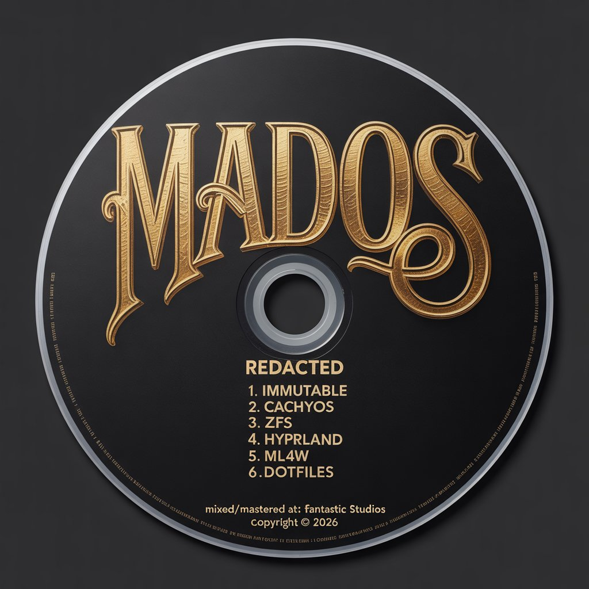

<div align="center">

<!-- Drop madOS-cd-logo.png into assets/ and it appears here automatically -->


<br/>

[](https://github.com/richknowles/madOS/actions/workflows/build.yml)

</div>

---

My personal Linux setup, packaged as a bootable ISO you can drop on any machine and be home in under 30 minutes. Powered by CachyOS, rooted on ZFS, and dressed in ML4W Hyprland straight from my own dotfiles.

The trick: **ZFS boot environments**. Before any update, snapshot the system. If it goes sideways, reboot and pick the snapshot — no recovery USBs, no reinstalls, no prayer. The bootloader does it.

---

## The stack

| | |
|---|---|
| **Base** | [CachyOS](https://cachyos.org) — Arch Linux, performance-optimized |
| **Filesystem** | [OpenZFS](https://openzfs.org) — snapshots, compression, no fuss |
| **Bootloader** | [ZFSBootMenu](https://zfsbootmenu.org) — pick a snapshot right at boot |
| **Desktop** | [Hyprland](https://hyprland.org) via [ML4W](https://github.com/mylinuxforwork/dotfiles) |
| **Dotfiles** | [richknowles/.dotfiles](https://github.com/richknowles/.dotfiles) — Fish, Waybar, Kitty, the works |
| **Installer** | Custom `dialog` TUI — boots straight into it, zero fuss |

---

## Installer

Boot the ISO. The installer comes up automatically. Answer six questions and walk away.

<div align="center">

</div>

**What it asks:**
- Which disk to use (shows model + size, you just pick)
- Hostname, username, passwords
- Timezone
- Your dotfiles repo URL *(pre-filled — change it to yours or leave it)*
- GitHub token *(only if your dotfiles are private — leave blank otherwise)*

**What it does next, without further input:**
1. GPT partition table — 512 MB EFI, rest goes to ZFS
2. ZFS pool + datasets (system, home, logs, cache — all separate)
3. CachyOS base install via `pacstrap`
4. ZFSBootMenu as the EFI bootloader
5. Clones dotfiles → runs `install.sh` → runs `scripts/install-packages.sh`
6. Installs ML4W Hyprland from AUR
7. Takes the first snapshot (`baseline-ml4w`)
8. Reboots

First boot drops you into ZFSBootMenu, then SDDM, then ML4W Welcome to finish the Hyprland config.

---

## How rollback works

```
zroot/
├── ROOT/arch        ← everything pacman touches. snapshotted before updates.
├── data/home        ← your files. survives any root rollback.
└── var/log          ← logs
    var/cache        ← package cache (not snapshotted)
```

```bash
# Step 1 — before you update anything:
sudo zfs snapshot zroot/ROOT/arch@before-$(date +%Y%m%d)

# Step 2 — update as normal:
sudo pacman -Syu

# Step 3 — if it breaks, just reboot.
# ZFSBootMenu lists your snapshots. Arrow key, Enter. Done.
```

No extra tooling. No container runtime. No learning curve. It's just ZFS.

---

## Get the ISO

**Latest build** — [GitHub Actions → most recent workflow run → Artifacts](https://github.com/richknowles/madOS/actions/workflows/build.yml)

**Releases** — tagged commits publish to [Releases](https://github.com/richknowles/madOS/releases) automatically.

```bash
# Flash to USB (replace /dev/sdX with your drive):
dd if=madOS-*.iso of=/dev/sdX bs=4M status=progress oflag=sync
```

---

## Build it yourself

Needs Arch Linux (or CachyOS) with `archiso` installed.

```bash
git clone https://github.com/richknowles/madOS
cd madOS

# Defaults are in config/defaults.conf
# Override any of them by copying to the live image root:
cp config/defaults.conf archiso/airootfs/root/config.conf

sudo mkarchiso -v -w /tmp/work -o /tmp/out archiso/
```

The GitHub Actions workflow does the same thing in an Arch container — builds on every push to `main`, weekly on Sundays, and on demand. Artifacts stick around for 14 days.

---

## What's in the repo

```
madOS/
├── archiso/
│   ├── profiledef.sh
│   ├── packages.x86_64          # live ISO packages
│   ├── pacman.conf               # CachyOS repos included
│   └── airootfs/root/
│       ├── install.sh            # the installer
│       ├── zfs-setup.sh          # partitioning + pool + datasets
│       └── ml4w-setup.sh         # dotfiles + ML4W
├── assets/
│   ├── madOS-cd-logo.png         # ← place your PNG here
│   └── tui-demo.svg
├── config/
│   └── defaults.conf             # dotfiles URL, hostname, etc.
└── .github/workflows/
    └── build.yml
```
